# Individual - Dashboard administrativo de empleados

Simone Ávila Arranz - P5 Factoría F5

## Descripción

Este trabajo consistía en la creación de una aplicación web de tipo dashboard de empleados al que acceder a través de un login. Los principales requisitos a tener en cuenta eran los siguientes:

- Permitir el acceso al dashboard a través del login introduciendo un email válido y una contraseña de al menos 8 caracteres y con 1 número.
- Mostrar una galería de empleados obtenidos desde una API externa.
- Permitir el filtrado de empleados mediante la primera letra del nombre.
- Gestionar la sesión de usuario usando localStorage.
- Ser responsive para mobile y desktop.

## Planificación

La planificación del trabajo a realizar fue gestionada a través de Jira. Se crearon las siguientes épicas subdivididas en tareas e historias de usuario:

🟣 **Épica 1: Estructura HTML Semántica**  
🔵 Crear index.html con estructura base  
🔵 Maquetar sección de login con etiquetas semánticas  
🔵 Maquetar layout del dashboard  
🔵 Crear componente tarjeta de empleado reutilizable  
🔵 Maquetar panel de filtro alfabético  

🟣 **Épica 2: Estilos CSS3 Modulares y Responsivos**  
🔵 Crear base.css con variables y reset  
🔵 Crear login.css con estilos del formulario  
🔵 Crear dashboard.css con layout Grid  
🔵 Crear components.css para tarjetas de empleado  
🔵 Añadir media queries responsive  
🔵 Estilizar barra de navegación superior y panel de filtro alfabético  

🟣 **Épica 3: JavaScript Modular por Funcionalidad**  
🔵 Crear validators.js con funciones de validación  
🔵 Crear auth.js para gestión de sesión  
🔵 Implementar lógica de login en app.js  
🔵 Crear api.js para consumo de empleados  
🔵 Implementar filtrado por primera letra del nombre  
🔵 Escribir test unitario con Vitest  
🟢 Acceso al dashboard administrativo  
🟢 Listado de empleados  
🟢 Filtrado de empleados por la primera letra del nombre  
🟢 Logout del dashboard  
🟢 Validación de credenciales en el formulario del login  

🟣 **Épica 4: Organización del Proyecto en Carpetas y Archivos**  
🔵 Crear carpeta /src en la raíz del proyecto  
🔵 Crear subcarpeta /src/assets para recursos estáticos  
🔵 Crear subcarpeta /src/styles para hojas CSS  
🔵 Crear subcarpeta /src/scripts para archivos JavaScript  
🔵 Ubicar index.html en la raíz del proyecto  
🔵 Verificar que no existen archivos sueltos fuera de la estructura  
🔵 Configurar .gitignore con exclusiones necesarias  

🟣 **Épica 5: Documentación y Gestión del Proyecto**  
🔵 Redactar README  
🔵 Diseño de prototipo y userflow  
🔵 Configurar Jira con épicas e historias de usuario  
🔵 Documentar los commits  

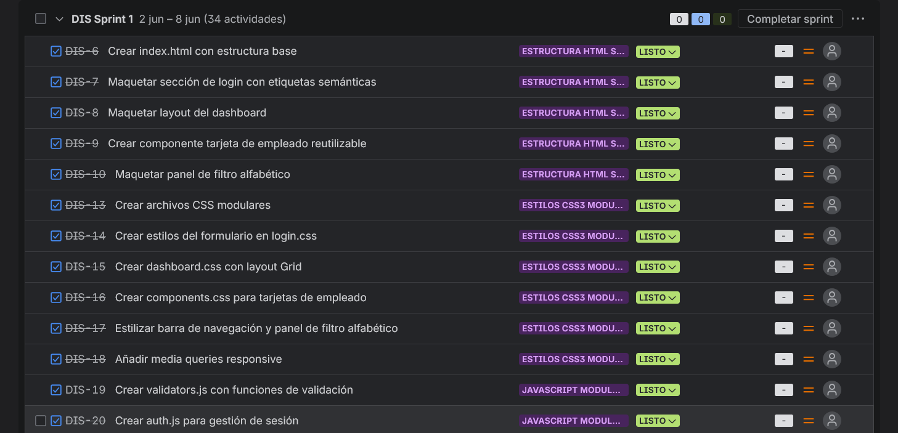
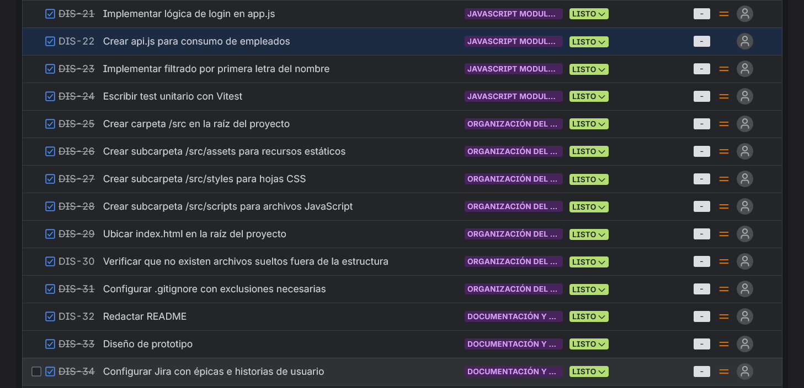
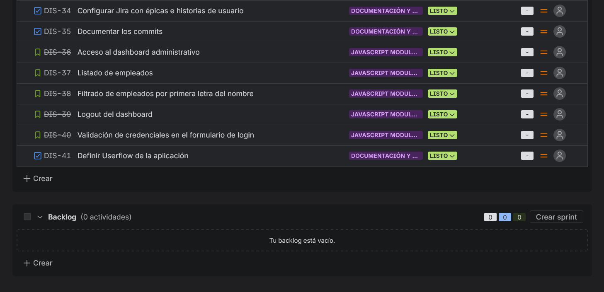

## Prototipo

Los prototipos de las páginas fueron creados inicialmente mediante el uso de Stitch, para, a continuación, configurar los resultados utilizando Figma para obtener un sketch más unitario y fiel al resultado que buscábamos. También se tomó como referencia el moodboard generado por Stitch para dar con un diseño limpio y coherente.

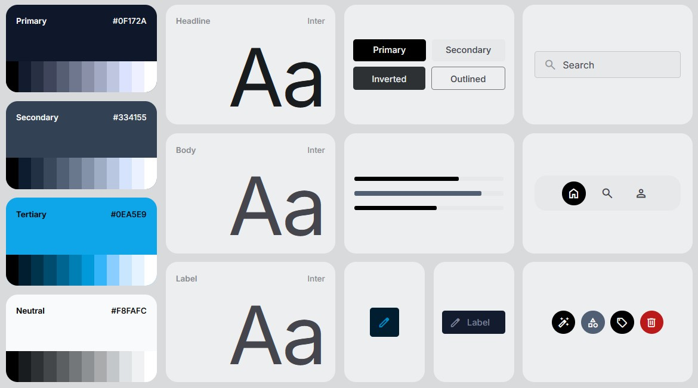
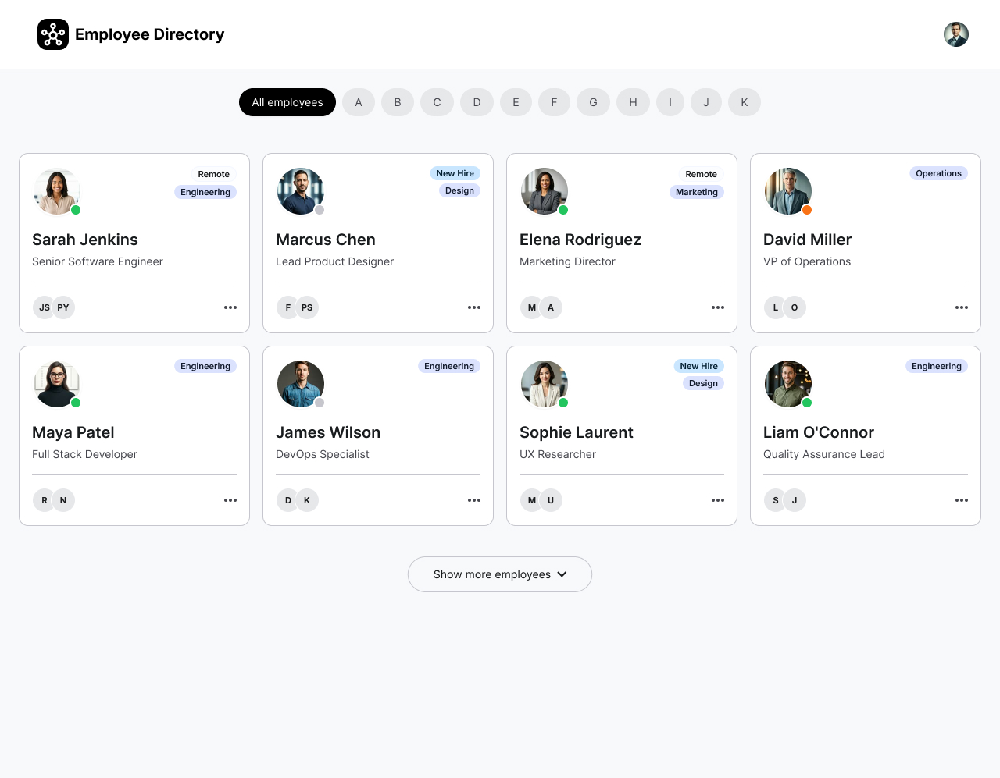
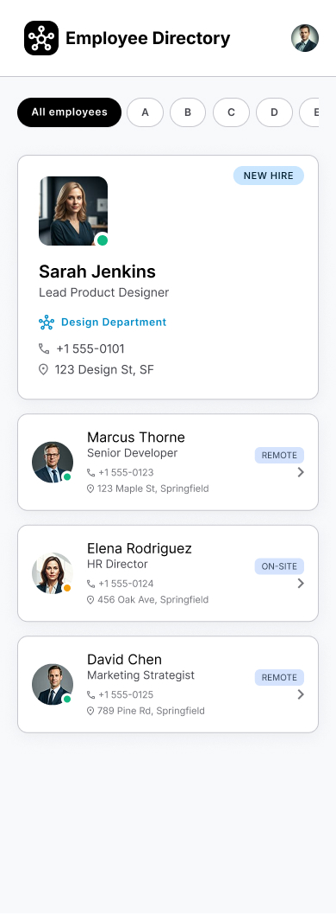
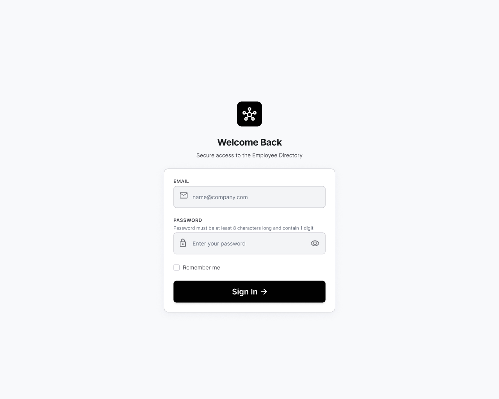
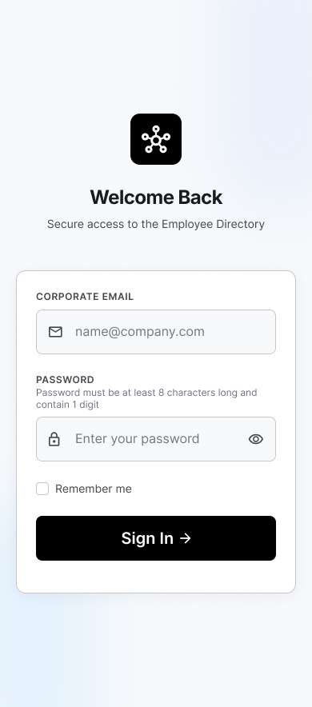

## Userflow

En base al sketch se creó el userflow definiendo los pasos que seguiría el usuario en caso de utilizar la aplicación, utilizando Figma. El resultado fue el siguiente:  

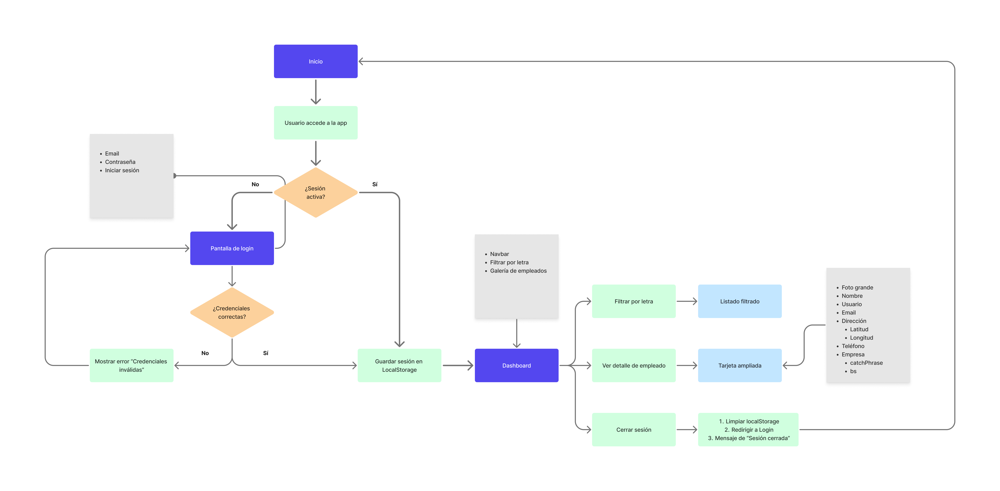

## Historias de usuario y criterios de aceptación

🟢 **Acceso al dashboard administrativo**  
- *Como* usuario administrador
- *Quiero* acceder a un dashboard mediante email y contraseña
- *Para* poder gestionar la información de los empleados  

🟢 **Listado de empleados**  
- *Como* usuario administrador autenticado
- *Quiero* ver un listado de empleados
- *Para* consultar sus datos básicos de contacto y dirección  

🟢 **Filtrado de empleados por la primera letra del nombre**  
- *Como* usuario administrador autenticado
- *Quiero* filtrar el listado de empleados por la primera letra del nombre
- *Para* encontrar más rápido a un empleado concreto  

🟢 **Logout del dashboard**  
- *Como*  usuario administrador autenticado
- *Quiero* filtrar el listado de empleados por la primera letra del nombre
- *Para* encontrar más rápido a un empleado concreto

🟢 **Validación de credenciales en el formulario del login**  
- *Como* usuario administrador autenticado
- *Quiero* poder cerrar sesión desde el dashboard
- *Para* que nadie más pueda usar mi sesión abierta  

## Instalación

- Paso 1: Clonar repositorio.

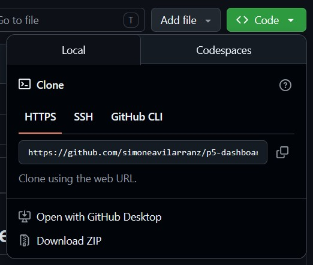

- Paso 2: Instalar dependencias.

```javascript
npm install -D vitest
```

- Paso 3: Crear archivo "credentials.json" dentro de la carpeta "data" para añadir las credenciales de usuario admin, añadir "src/data/credentials.json" a archivo .gitignore

```javascript
{
  "admin": {
    "email": "admin@empresa.com",
    "password": "Admin1234"
  }
}
```

- Paso 4: Realizar los tests en pestaña "testing" para asegurar el funcionamiento de la aplicación.

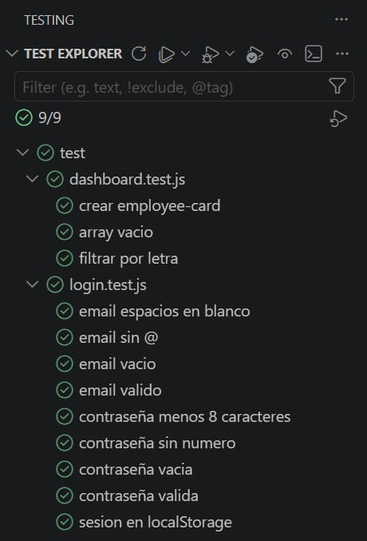

- Paso 5: Para utilizar la aplicación utilizar "Open with Live Server" en el archivo "index.html" situado en la raíz del proyecto, ya que es el archivo del login.

## Resultado final

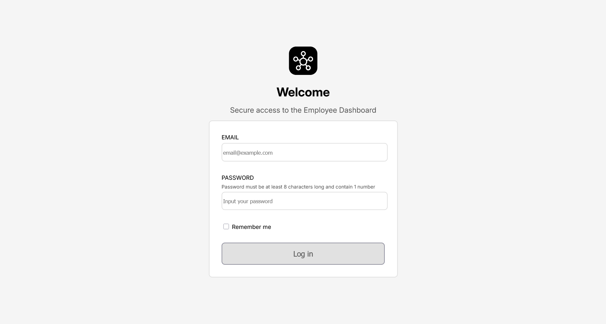
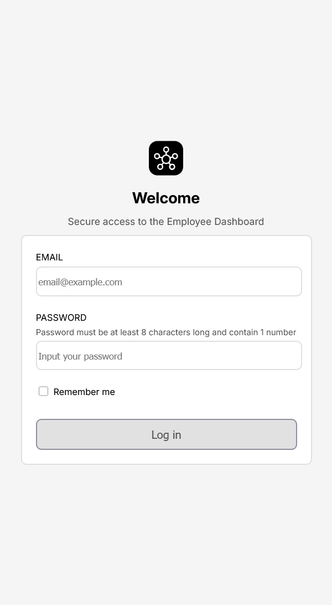
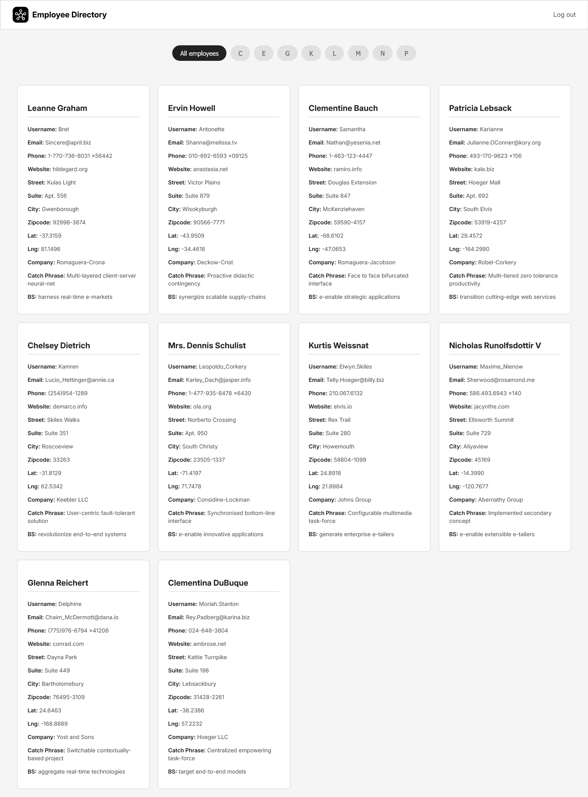
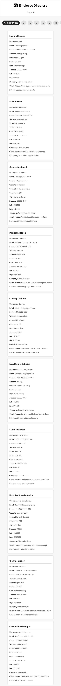

## Autora

- Simone Ávila Arranz